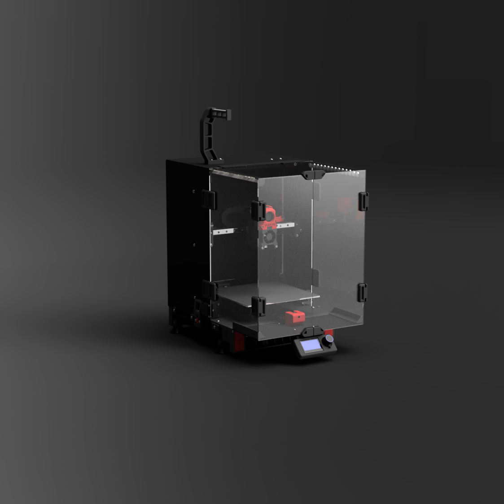
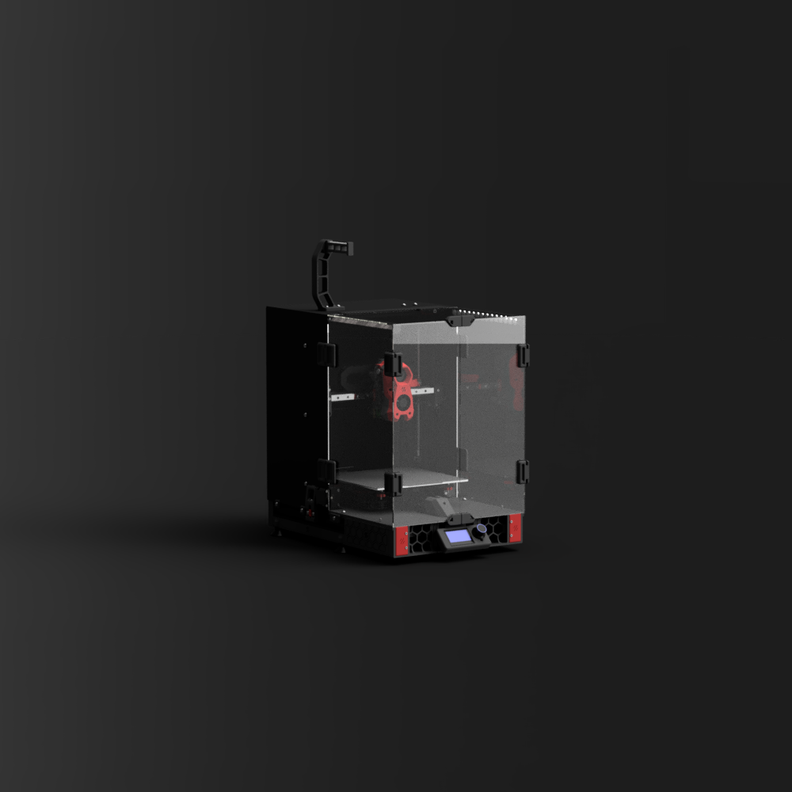

# Ender 3 Pro/V2 to Switchwire Conversion

This is a full conversion of the popular Ender 3 Pro/V2 to a Voron Switchwire and a collaborate work with [Triano](https://github.com/walttriano). The motivation came from [his awesome original conversion](https://github.com/walttriano/VoronUsers/tree/master/printer_mods/Triano/Ender_3Pro_Switchwire) that was used as a starting point, however almost everything was re-designed from scratch (in order to follow the Voron guidelines and aesthetics more accurately). Another factor that led to this re-design, was the need to be able to enclose this printer in a, visually, pleasant and, structurally, functional way. The ingenious design of 5x MGN12H Linear Rails - 300mm (dual Y axis rail) from Triano was preserved and the printing volume is ~220x220x220.

## Info

Various parts _can*_ be recycled from the Ender 3 Pro/V2, most important ones are:
- The frame (though a 310mm extrusion is needed for the X. You can chop the original one to length).
- The MeanWell PSU.
- The heatbed assemble.
- The original board.
- XYZ motors (as long as you can pull off the pulleys. An aftermarket 20mm motor is needed for the printhead extruder though).
- All the cables that don't go through the cable-chains (for there, silicone or PTFE cable is adviced).
- 4010 fan for the tool cooling.

*cheaping out in parts can lead into several problems, such as poor printing quality or, even worse, safety hazzard. Keep that in mind and use parts from the official Switchwire BOM.

## Files

- Most of the printed part files needed for this conversion, are included in this git (you will only need to get the Afterburner print files from the [official Switchwire git](https://github.com/VoronDesign/Voron-Switchwire/tree/master/STL/Gantry/XZ_Axis/X_Carriage) ).
- CAD files (.f3d and .STEP) are provided, in order to help the building process, but they also serve as a BOM (in case you need to find proper screw lengths etc).
- DXF files in order to cut your enclosure panels.
- A printer.cfg as a starting point (based off LDO motors and SKR E3 mini V2 board).

## Credits

- Ofc to Triano for his awesome design and all the valuable help, info and support.
- To marcel#0874 for his original idea of the sticky grill endcaps.
- To sdukan#9213 for his valuable help into troubleshooting the Ender 3 V2 differences, electronics (and in general)
- To all of this awesome community of people.
- To Voron design team for all the valuable resources and the solid base.

## Disclaimer

This is a very carefuly designed build.. however mistakes could have been made so by deciding to follow this conversion, you are responsible for any possible damage done to the printer or even yourself. This is serious so keep that in mind.
